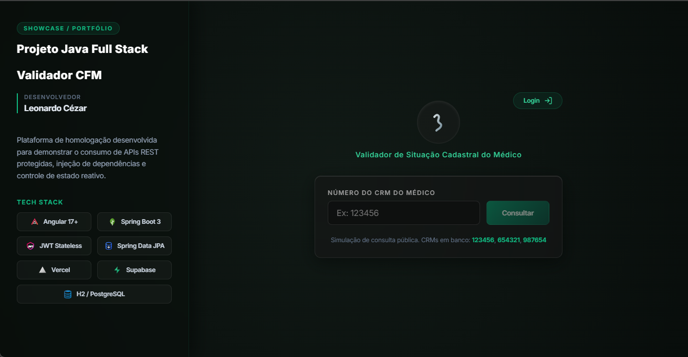
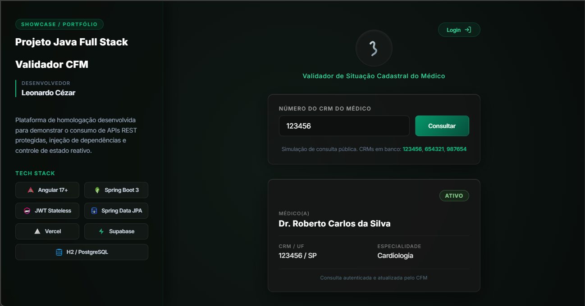
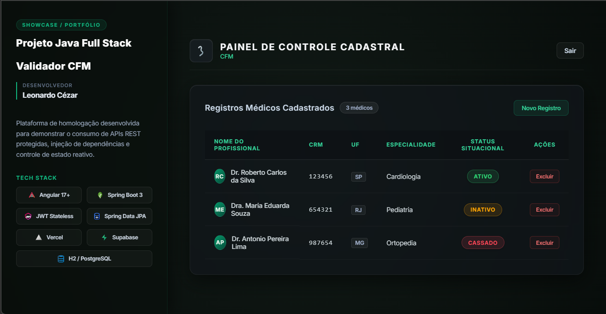
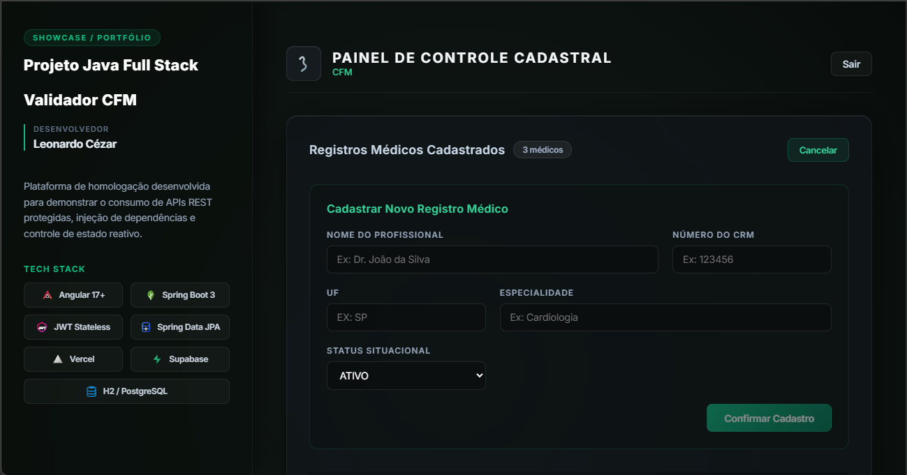
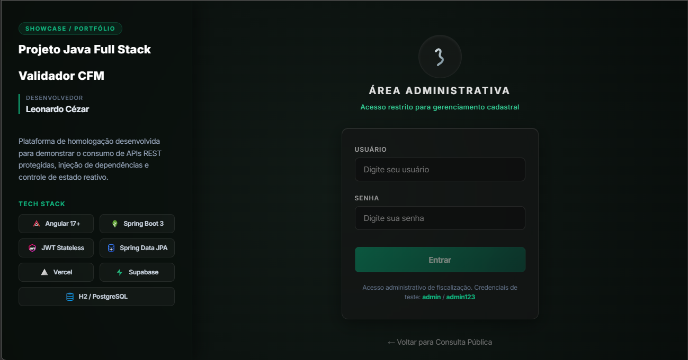
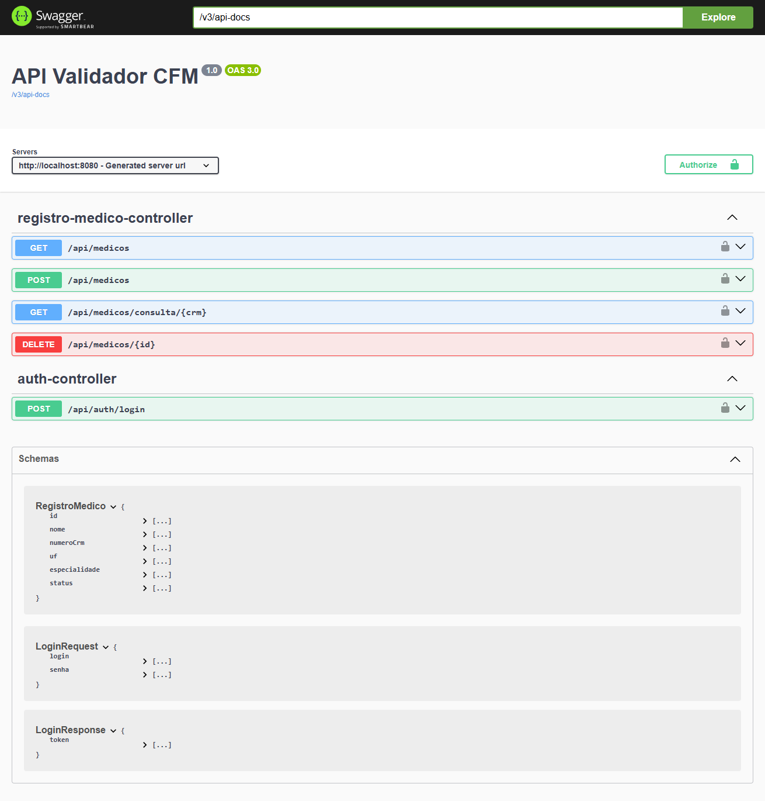

# Sistema de Validação Cadastral - Conselho Federal de Medicina (CFM)

Plataforma full-stack desenvolvida como avaliação técnica para demonstrar a orquestração de APIs REST protegidas, integração com bancos de dados relacionais e controle de estado em Single Page Applications (SPA).

## 🚀 Arquitetura e Tecnologias

### Backend (API REST)
* **Java 21 & Spring Boot 3:** Infraestrutura principal da aplicação.
* **Spring Data JPA & Hibernate:** Mapeamento objeto-relacional (ORM) e persistência de dados.
* **Spring Security & JJWT:** Controle de acesso baseado em roles, autenticação Stateless via JSON Web Tokens (JWT) e encriptação BCrypt.
* **PostgreSQL (Supabase) / H2:** Banco de dados de produção e banco em memória para ambiente de desenvolvimento.
* **Springdoc OpenAPI (Swagger):** Documentação viva e interativa dos endpoints.

### Frontend (Portal)
* **Angular 17+:** Interface construída com Standalone Components.
* **RxJS & Signals:** Gerenciamento de estado reativo e detecção de mudanças (Change Detection).
* **HTTP Interceptors:** Injeção automática de tokens JWT em rotas protegidas.
* **Design System Customizado:** Implementação de layout de alta performance utilizando tipografia limpa, dark mode e efeitos de glassmorphism.

## ⚙️ Funcionalidades Implementadas
- [x] **Consulta Pública:** Motor de busca instantâneo de registros pelo número do CRM, sem necessidade de autenticação (Acesso Cidadão).
- [x] **Painel de Fiscalização:** Acesso restrito para funcionários via login (`/login`).
- [x] **Operações CRUD:** Listagem, inserção e exclusão lógica de médicos, com atualização de estado reativo na tabela em tempo real.
- [x] **Data Seeding:** Injeção automatizada de dados iniciais e administrador padrão (`admin` / `admin123`) ao detectar banco vazio.

## 🛠️ Como Executar Localmente

### Pré-requisitos
- JDK 21
- Node.js (v20+)
- Maven

### Passos
1. **Backend:**
   ```bash
   ./mvnw spring-boot:run
   ```
   A API rodará na porta 8080. O Swagger estará disponível em: http://localhost:8080/swagger-ui.html.

2. **Frontend:**
   Em um novo terminal:
   ```bash
   cd portal-cfm
   npm install
   ng serve
   ```
   O portal estará disponível em: http://localhost:4200.

## 📷 Demonstração Visual e Telas do Sistema

### 1. Consulta Pública (Acesso Cidadão)
Interface de busca rápida e intuitiva baseada no CRM do médico para validação de sua situação cadastral:



### 2. Resultado da Consulta
Card detalhado apresentando as informações do médico pesquisado e seu status legal perante o conselho:



### 3. Painel de Login Administrativo
Autenticação segura via JWT para acesso ao painel de controle restrito:



### 4. Painel de Controle (Gerenciamento de Médicos)
Dashboard administrativo completo com a listagem de registros médicos ativos, inativos e cassados:



### 5. Cadastro de Médico
Formulário dinâmico com validação para inserção de novos profissionais médicos no sistema:



### 6. Operações de Exclusão Lógica e Alteração de Status
Feedback visual imediato e reativo ao inativar/atualizar um registro cadastral:



### 7. Documentação Interativa da API (Swagger)
Exposição de todos os endpoints RESTful públicos e protegidos com suporte a testes em tempo real:


